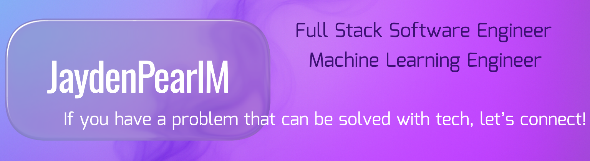

<!-- Banner -->

  

---
<!-- Buy Me a Coffee -->

  

---
### 🚀 Featured Projects
[Devfolio](https://github.com/JaydenPearlM/Devfolio) — Portfolio + Analytics site built with full stack tech

### 🧠 About Me
I build clean, responsive web and desktop applications using modern full stack tools.  
I enjoy transforming complex ideas into fast, reliable, and intuitive interfaces with great UX.  
I'm also experienced in building intelligent apps using AI and Machine Learning.

---
### 🧱 Tech Stack

#### 💻 Full Stack Development

  
  
  
  
  
  

#### 🤖 Machine Learning & Data Science

  
  
  
  
  
  
  
  

---
### 📬 Contact Me
- **Email:** JaydenMaxwell6790@outlook.com  
- **LinkedIn:** [linkedin.com/in/jaydenmaxwell](https://www.linkedin.com/in/jaydenmaxwell)  
- **Portfolio:** [jayden-portfolio-axk9.onrender.com](https://jayden-portfolio-axk9.onrender.com)
